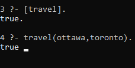
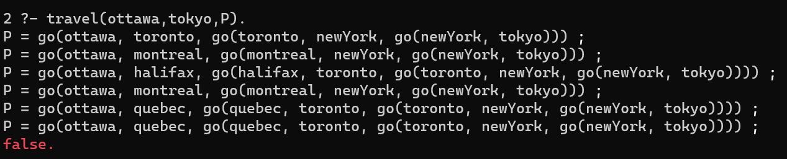

Prolog Presentation  

```Person 1```
# Trip Planning with Prolog

The best way to learn a new language is to use it. So today, we would like to talk about something you can do with prolog in the real life. 

Planning a trip can sometimes be a difficult task. balabala....

## So, What is Prolog.
* Declarative Programming
* How is it different from other languages like python. 


balbalab...

(Handover to next person phrases)  
`Person 2`
### Let's get the ball rolling

(We can talk about Fact, atomic  etc)

```Prolog
% We are given the following knowledge base of travel information:
byCar(ottawa,toronto).
byCar(ottawa,montreal).
byCar(quebec,toronto).
byCar(vancouver,victoria).

byTrain(ottawa,yellowknife).
byTrain(quebec,toronto).
byTrain(ottawa,calgary).
byTrain(ottawa,edmonton).
byTrain(ottawa,regina).
byTrain(ottawa,winnipeg).
byTrain(ottawa,halifax).
byTrain(victoria,toronto).
byTrain(victoria,montreal).
byTrain(halifax,toronto).

byPlane(ottawa,montreal).
byPlane(ottawa,quebec).
byPlane(toronto,newYork).
byPlane(toronto,losAngeles).
byPlane(montreal,paris).
byPlane(newYork,tokyo).
byPlane(montreal,newYork).

```

Now, we already have some knowledge base, next we want to find if two city is reachable.

(Handover to next person phrases)

`Person 3`
### Can I travel from Ottawa to Toronto?

To solve this question, someone here may already has an idea in your mind.  We can ask prolog to do if for us, but before it, we need to set up our rules.

1. Lets say you can `travel` from `S` and `E` if and only if:
2. You can go form `S` to `E` `byCar`, `byTrain` or `byPlane`; or
3. There is a connection city `M`, which you can go from `S` to `M`, then from `M` to `E`.

we can easily implement it in prolog.
```Prolog
travel(S, E) :- just_go(S, E).     % base case
travel(S, E) :- just_go(S, M), travel(M, E).

just_go(S, E) :- byCar(S, E).
just_go(S, E) :- byTrain(S, E).
just_go(S, E) :- byPlane(S, E).
```
(talk about recursion, rules, predicate , etc...)  



Now we can easily check whether two city are reachable or not with prolog, but we are not done yet!

We want to find the path between two cities.
(Handover to next person phrases)  
`Person 4`

### Prolog, I am in Ottawa, and want to visit Tokyo, tell me the path.

We want to find the path `P`  from  `S` to `E`.

1. If we can directly go from `S` to `E`, then `P` will simply be `go(S,E)`
2. If there is another city  `M` , that we know we can directly go from `S` to `M` , then `M` to `E`. The path between `S` and `E` will be `go(S,M,P)`.


```Prolog
travel(S,E, go(S, E)) :- just_go(S,E).
travel(S,E, go(S, M, P)) :- just_go(S,M), travel(M,E,P).
```

Now, Prolog can tell us how to go from Ottawa to Tokyo.

